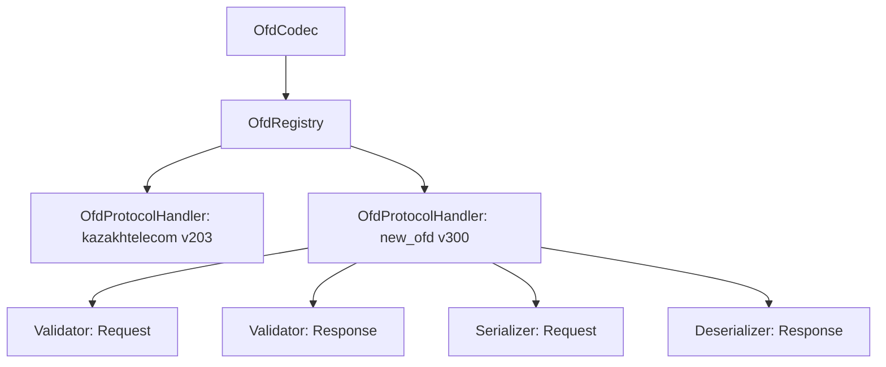

# Library Extension Guide (Adding new OFDs and protocols) / Руководство по расширению библиотеки (Добавление новых ОФД и протоколов)

The `ofd-proto-codec` library is designed following the principles of Clean Architecture and SOLID. This allows for easy addition of new OFD protocol versions or new providers (e.g. Transtelecom, KazakhTelecom v3.0.0, etc.) without modifying the core codec logic.
/ Библиотека `ofd-proto-codec` спроектирована по принципам Чистой Архитектуры и SOLID, что позволяет легко добавлять поддержку новых версий протокола ОФД или новых провайдеров (например, Транстелеком, Казахтелеком v3.0.0 и т.д.) без изменения ядра кодека.

> [!IMPORTANT]
> All port interfaces (`Validator`, `Serializer`, `Deserializer`) and the registry `OfdRegistry` are declared with `internal` visibility to prevent leakage of implementation details outside the library. Adding new protocols and OFD providers must be done by creating corresponding packages directly within the source code of this library (in the directory `src/main/kotlin/kz/mybrain/ofdcodec/ofd/`).
>
> Все интерфейсы портов (`Validator`, `Serializer`, `Deserializer`) и реестр `OfdRegistry` объявлены с видимостью `internal` для предотвращения утечки деталей реализации наружу библиотеки. Добавление новых протоколов и ОФД должно производиться путем создания соответствующих пакетов непосредственно внутри исходного кода этой библиотеки (в папке `src/main/kotlin/kz/mybrain/ofdcodec/ofd/`).

---

## Extension Architecture / Архитектура расширений

The library core (`kz.mybrain.ofdcodec.domain`) interacts with specific protocol versions through interfaces (ports):
1. **`Validator`** — validates the JSON representation of requests/responses before encoding or after decoding.
2. **`Serializer`** — converts structured JSON to a Protobuf byte array (`ByteArray`).
3. **`Deserializer`** — decodes a Protobuf byte array back to JSON.

All handlers are grouped into the **`OfdProtocolHandler`** structure and registered in **`OfdRegistry`** under a specific OFD identifier (`ofdId`) and protocol version (`protocolVersion`).

/ Ядро библиотеки (`kz.mybrain.ofdcodec.domain`) взаимодействует с конкретными версиями протоколов через интерфейсы (порты):
1. **`Validator`** — валидация JSON-представления запросов/ответов перед отправкой или после получения.
2. **`Serializer`** — преобразование структурированного JSON в байтовый массив Protobuf (`ByteArray`).
3. **`Deserializer`** — декодирование байтового массива Protobuf обратно в JSON.

Все обработчики группируются в структуру **`OfdProtocolHandler`** и регистрируются в **`OfdRegistry`** под определенным идентификатором ОФД (`ofdId`) и версией протокола (`protocolVersion`).



---

## Step-by-Step Guide / Пошаговое руководство

Suppose we need to add support for a new OFD `"transtelecom"` with protocol version `"300"`.
/ Допустим, необходимо добавить поддержку нового ОФД `"transtelecom"` с версией протокола `"300"`.

### Step 1: Connect Generated Protobuf Classes / Шаг 1: Подключение сгенерированных Protobuf классов
Ensure that the Java/Kotlin classes generated from `.proto` files are available in the project (typically added via a dependency like `ofd-kt-proto` or compiled by the `protobuf` Gradle plugin).
/ Убедитесь, что сгенерированные из `.proto` файлов Java/Kotlin классы доступны в проекте (обычно подключаются через зависимость вроде `ofd-kt-proto` или компилируются Gradle-плагином `protobuf`).

### Step 2: Implement Validators (`Validator`) / Шаг 2: Реализация валидаторов (`Validator`)
Create request and response validators implementing the `kz.mybrain.ofdcodec.domain.port.Validator` interface.
/ Создайте валидаторы для запросов и ответов, реализующие интерфейс `kz.mybrain.ofdcodec.domain.port.Validator`.

> [!TIP]
> Use extension methods from `ValidationUtils.kt` to check types, mandatory fields, and number ranges to avoid code duplication.
> / Используйте методы-расширения из `ValidationUtils.kt` для проверки типов, обязательных полей и диапазонов чисел, чтобы не дублировать код.

```kotlin
package kz.mybrain.ofdcodec.ofd.transtelecom.v300.validation

import kotlinx.serialization.json.JsonObject
import kz.mybrain.ofdcodec.domain.model.CommandType
import kz.mybrain.ofdcodec.domain.model.ValidationError
import kz.mybrain.ofdcodec.domain.port.Validator

class TranstelecomV300RequestValidator : Validator {
    override fun validate(commandType: CommandType, json: JsonObject): List<ValidationError> {
        val errors = mutableListOf<ValidationError>()
        when (commandType) {
            CommandType.COMMAND_TICKET -> {
                // Validate JSON structure of the ticket / Валидация JSON структуры чека по схеме v300
            }
            else -> { /* Other commands / Другие команды */ }
        }
        return errors
    }
}
```

### Step 3: Implement Request Serializer (`Serializer`) / Шаг 3: Реализация сериализатора запросов (`Serializer`)
Create a serializer that converts JSON to Protobuf bytes:
/ Создайте сериализатор, переводящий JSON в байты Protobuf:

```kotlin
package kz.mybrain.ofdcodec.ofd.transtelecom.v300.codec

import kotlinx.serialization.json.JsonObject
import kz.mybrain.ofdcodec.domain.model.CommandType
import kz.mybrain.ofdcodec.domain.port.Serializer

class TranstelecomV300RequestSerializer : Serializer {
    override fun serialize(commandType: CommandType, json: JsonObject): ByteArray {
        return when (commandType) {
            CommandType.COMMAND_TICKET -> {
                // 1. Read fields from JSON / Чтение полей из JSON
                // 2. Build Protobuf model v300 / Сборка Protobuf-модели v300
                // 3. Return .toByteArray() / Возврат .toByteArray()
            }
            else -> throw IllegalArgumentException("Unsupported command")
        }
    }
}
```

### Step 4: Implement Response Deserializer (`Deserializer`) / Шаг 4: Реализация десериализатора ответов (`Deserializer`)
Create a deserializer that converts response bytes back to JSON:
/ Создайте десериализатор, переводящий байты ответа обратно в JSON:

```kotlin
package kz.mybrain.ofdcodec.ofd.transtelecom.v300.codec

import kotlinx.serialization.json.JsonObject
import kotlinx.serialization.json.buildJsonObject
import kz.mybrain.ofdcodec.domain.port.Deserializer

class TranstelecomV300ResponseDeserializer : Deserializer {
    override fun deserialize(bytes: ByteArray): JsonObject {
        // 1. Parse bytes into Protobuf model v300 / Парсинг байт в Protobuf-модель v300
        // 2. Convert fields to a JSON object / Преобразование полей в JSON объект
        // 3. Return JsonObject / Возврат JsonObject
    }
}
```

### Step 5: Create and Register the Module / Шаг 5: Создание и регистрация модуля
Create a module object to group the handlers:
/ Создайте объект модуля для группировки обработчиков:

```kotlin
package kz.mybrain.ofdcodec.ofd.transtelecom.v300

import kz.mybrain.ofdcodec.domain.registry.OfdProtocolHandler
import kz.mybrain.ofdcodec.domain.registry.OfdRegistry
import kz.mybrain.ofdcodec.ofd.transtelecom.v300.codec.TranstelecomV300RequestSerializer
import kz.mybrain.ofdcodec.ofd.transtelecom.v300.codec.TranstelecomV300ResponseDeserializer
import kz.mybrain.ofdcodec.ofd.transtelecom.v300.validation.TranstelecomV300RequestValidator
import kz.mybrain.ofdcodec.ofd.transtelecom.v300.validation.TranstelecomV300ResponseValidator

object TranstelecomV300Module {
    const val OFD_ID = "transtelecom"
    const val PROTOCOL_VERSION = "300"

    fun register(registry: OfdRegistry) {
        val handler = OfdProtocolHandler(
            ofdId = OFD_ID,
            protocolVersion = PROTOCOL_VERSION,
            requestValidator = TranstelecomV300RequestValidator(),
            requestSerializer = TranstelecomV300RequestSerializer(),
            responseValidator = TranstelecomV300ResponseValidator(),
            responseDeserializer = TranstelecomV300ResponseDeserializer()
        )
        registry.register(handler)
    }
}
```

### Step 6: Initialize in the Application / Шаг 6: Инициализация в приложении
To use the new OFD, register it in the registry when creating the `OfdCodec` instance:
/ Для использования нового ОФД зарегистрируйте его в реестре при создании экземпляра `OfdCodec`:

```kotlin
import kz.mybrain.ofdcodec.application.OfdCodec
import kz.mybrain.ofdcodec.application.DefaultRegistry
import kz.mybrain.ofdcodec.ofd.transtelecom.v300.TranstelecomV300Module

// 1. Create a registry / Создаем реестр
val registry = DefaultRegistry.create() // Already contains kazakhtelecom v203 / Уже содержит kazakhtelecom v203

// 2. Register the new OFD / Регистрируем новый ОФД
TranstelecomV300Module.register(registry)

// 3. Create the codec / Создаем кодек
val codec = OfdCodec(registry)
```

Now, when calling `codec.encode(json)` with `"ofdId": "transtelecom"` and `"protocolVersion": "300"` inside the JSON envelope, the codec will automatically forward the message to your new handler.
/ Теперь при вызове `codec.encode(json)` с `"ofdId": "transtelecom"` и `"protocolVersion": "300"` внутри JSON-конверта, кодек автоматически направит сообщение вашему новому обработчику.
