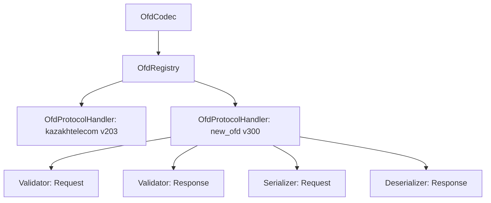

# Руководство по расширению библиотеки (Добавление новых ОФД и протоколов)

Библиотека `ofd-proto-codec` спроектирована по принципам Чистой Архитектуры и SOLID, что позволяет легко добавлять поддержку новых версий протокола ОФД или новых провайдеров (например, Транстелеком, Казахтелеком v3.0.0 и т.д.) без изменения ядра кодека.

---

## Архитектура расширений

Ядро библиотеки (`kz.mybrain.ofdcodec.domain`) взаимодействует с конкретными версиями протоколов через интерфейсы (порты):
1. **`Validator`** — валидация JSON-представления запросов/ответов перед отправкой или после получения.
2. **`Serializer`** — преобразование структурированного JSON в байтовый массив Protobuf (`ByteArray`).
3. **`Deserializer`** — декодирование байтового массива Protobuf обратно в JSON.

Все обработчики группируются в структуру **`OfdProtocolHandler`** и регистрируются в **`OfdRegistry`** под определенным идентификатором ОФД (`ofdId`) и версией протокола (`protocolVersion`).



---

## Пошаговое руководство

Допустим, необходимо добавить поддержку нового ОФД `"transtelecom"` с версией протокола `"300"`.

### Шаг 1: Подключение сгенерированных Protobuf классов
Убедитесь, что сгенерированные из `.proto` файлов Java/Kotlin классы доступны в проекте (обычно подключаются через зависимость вроде `ofd-kt-proto` или компилируются Gradle-плагином `protobuf`).

### Шаг 2: Реализация валидаторов (`Validator`)
Создайте валидаторы для запросов и ответов, реализующие интерфейс `kz.mybrain.ofdcodec.domain.port.Validator`. 

> [!TIP]
> Используйте методы-расширения из `ValidationUtils.kt` для проверки типов, обязательных полей и диапазонов чисел, чтобы не дублировать код.

```kotlin
package kz.mybrain.ofdcodec.ofd.transtelecom.v300.validation

import kotlinx.serialization.json.JsonObject
import kz.mybrain.ofdcodec.domain.model.CommandType
import kz.mybrain.ofdcodec.domain.model.ValidationError
import kz.mybrain.ofdcodec.domain.port.Validator

class TranstelecomV300RequestValidator : Validator {
    override fun validate(commandType: CommandType, json: JsonObject): List<ValidationError> {
        val errors = mutableListOf<ValidationError>()
        when (commandType) {
            CommandType.COMMAND_TICKET -> {
                // Валидация JSON структуры чека по схеме v300
            }
            else -> { /* Другие команды */ }
        }
        return errors
    }
}
```

### Шаг 3: Реализация сериализатора запросов (`Serializer`)
Создайте сериализатор, переводящий JSON в байты Protobuf:

```kotlin
package kz.mybrain.ofdcodec.ofd.transtelecom.v300.codec

import kotlinx.serialization.json.JsonObject
import kz.mybrain.ofdcodec.domain.model.CommandType
import kz.mybrain.ofdcodec.domain.port.Serializer

class TranstelecomV300RequestSerializer : Serializer {
    override fun serialize(commandType: CommandType, json: JsonObject): ByteArray {
        return when (commandType) {
            CommandType.COMMAND_TICKET -> {
                // 1. Чтение полей из JSON
                // 2. Сборка Protobuf-модели v300
                // 3. Возврат .toByteArray()
            }
            else -> throw IllegalArgumentException("Unsupported command")
        }
    }
}
```

### Шаг 4: Реализация десериализатора ответов (`Deserializer`)
Создайте десериализатор, переводящий байты ответа обратно в JSON:

```kotlin
package kz.mybrain.ofdcodec.ofd.transtelecom.v300.codec

import kotlinx.serialization.json.JsonObject
import kotlinx.serialization.json.buildJsonObject
import kz.mybrain.ofdcodec.domain.port.Deserializer

class TranstelecomV300ResponseDeserializer : Deserializer {
    override fun deserialize(bytes: ByteArray): JsonObject {
        // 1. Парсинг байт в Protobuf-модель v300
        // 2. Преобразование полей в JSON объект
        // 3. Возврат JsonObject
    }
}
```

### Шаг 5: Создание и регистрация модуля
Создайте объект модуля для группировки обработчиков:

```kotlin
package kz.mybrain.ofdcodec.ofd.transtelecom.v300

import kz.mybrain.ofdcodec.domain.registry.OfdProtocolHandler
import kz.mybrain.ofdcodec.domain.registry.OfdRegistry
import kz.mybrain.ofdcodec.ofd.transtelecom.v300.codec.TranstelecomV300RequestSerializer
import kz.mybrain.ofdcodec.ofd.transtelecom.v300.codec.TranstelecomV300ResponseDeserializer
import kz.mybrain.ofdcodec.ofd.transtelecom.v300.validation.TranstelecomV300RequestValidator
import kz.mybrain.ofdcodec.ofd.transtelecom.v300.validation.TranstelecomV300ResponseValidator

object TranstelecomV300Module {
    const val OFD_ID = "transtelecom"
    const val PROTOCOL_VERSION = "300"

    fun register(registry: OfdRegistry) {
        val handler = OfdProtocolHandler(
            ofdId = OFD_ID,
            protocolVersion = PROTOCOL_VERSION,
            requestValidator = TranstelecomV300RequestValidator(),
            requestSerializer = TranstelecomV300RequestSerializer(),
            responseValidator = TranstelecomV300ResponseValidator(),
            responseDeserializer = TranstelecomV300ResponseDeserializer()
        )
        registry.register(handler)
    }
}
```

### Шаг 6: Инициализация в приложении
Для использования нового ОФД зарегистрируйте его в реестре при создании экземпляра `OfdCodec`:

```kotlin
import kz.mybrain.ofdcodec.application.OfdCodec
import kz.mybrain.ofdcodec.application.DefaultRegistry
import kz.mybrain.ofdcodec.ofd.transtelecom.v300.TranstelecomV300Module

// 1. Создаем реестр
val registry = DefaultRegistry.create() // Уже содержит kazakhtelecom v203

// 2. Регистрируем новый ОФД
TranstelecomV300Module.register(registry)

// 3. Создаем кодек
val codec = OfdCodec(registry)
```

Теперь при вызове `codec.encode(json)` с `"ofdId": "transtelecom"` и `"protocolVersion": "300"` внутри JSON-конверта, кодек автоматически направит сообщение вашему новому обработчику.
